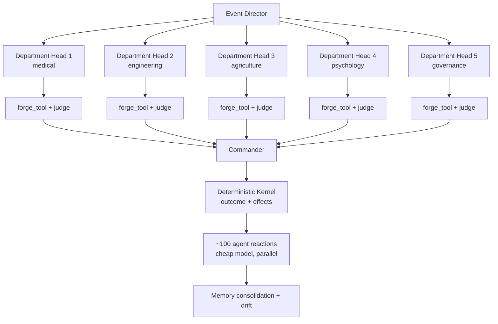

> "I do not know what I may appear to the world; but to myself I seem to have been only like a boy playing on the seashore… whilst the great ocean of truth lay all undiscovered before me."
>
> — Newton, attributed, 1727

> **Editor's note (2026-04-23):** Paracosm's positioning has evolved since this post was written. We now describe it as a *structured world model for AI agents* (Xing 2025; ACM CSUR 2025) and a *counterfactual world simulation model* (Kirfel et al, 2025). The mechanics below (tool forging + HEXACO propagation + judge review) are unchanged and accurate. For the updated placement against Sora / Genie 3 / MiroFish / OASIS / Concordia, see [Paracosm is a Structured World Model for AI Agents](/blog/paracosm-structured-world-model). For the long-form essay, see [Paracosm 2026 Overview](/blog/paracosm-2026-overview).

There is a thing I keep telling visitors about Paracosm that I'll repeat here because it's the part that surprised me the most. The first time I saw a department head agent forge a tool that wasn't in the prompt — that wasn't on the menu, that wasn't in any prior turn's history — and watched the LLM judge approve it and the sandbox execute it and the kernel apply its output, I had to stop and reread the artifact log. The agent had, in effect, written itself a new affordance. Three turns later, the same tool was being called by every other department in the run.

That's the mechanism this post is about. There are two pieces — emergent tool forging and HEXACO leader propagation — and they only matter as a pair. Forging without personality biasing produces a homogenous set of tools regardless of leader. Personality biasing without forging produces different *decisions* but the same *capability set*. Combine them and you get civilizations that diverge not only in what they choose but in what they're capable of choosing from.

## Two Leaders, One Seed, Two Civilizations

Run [Paracosm](https://paracosm.agentos.sh) with two leaders against the same scenario, the same kernel seed, the same opening crisis, and the same crew roster. By turn six the two colonies have measurably different populations, infrastructure counts, tool inventories, and political stances. No randomness changed. The Event Director produced the same events for both runs. What differs is whose decision passed through the pipeline and which computational tools each colony's department agents chose to forge in response.

This post walks through what actually happens on each turn, how emergent tool forging works under LLM judge review, how the optional HEXACO profile propagates through every sub-agent when you opt in, and how the same architecture maps to testing real leaders, policy frameworks, or autonomous decision systems against each other from a single controlled seed.

## The Turn Pipeline

Each turn passes through nine stages. Five of them call an LLM. Four are deterministic kernel steps that cannot diverge between two leaders sharing the same seed.

```
1. EVENT DIRECTOR      LLM   Observes state, generates events targeting real weaknesses
2. KERNEL ADVANCE      det.  Aging, births, deaths, resource production and consumption
3. DEPARTMENT ANALYSIS LLM   Parallel agents, each may forge a new computational tool
4. COMMANDER DECISION  LLM   Reads all department reports, selects an option
5. OUTCOME             det.  Seeded RNG plus option risk probability
6. EFFECTS             det.  Colony deltas applied through the EffectRegistry
7. AGENT REACTIONS     LLM   Every alive agent reacts in parallel on a cheap model
8. MEMORY              det.  Short-term consolidates, stances drift, relationships shift
9. PERSONALITY DRIFT   det.  HEXACO traits shift under leader pull, role pull, outcome pull
```

The scenario owns the domain (event categories, department roles, progression hooks, research citations). The engine owns the chassis (state, time, randomness, invariants). The orchestrator connects them. Everything below is grounded in the actual implementation at [paracosm/src/runtime/orchestrator.ts](https://github.com/framersai/paracosm/blob/master/src/runtime/orchestrator.ts).

## Emergent Tool Forging, in Detail

A forged tool is a small computational model that a department agent invents at runtime to analyze the current event. A Chief Medical Officer facing a radiation storm can forge a dose calculator. A Chief Engineer facing a life-support strain can forge a load analyzer. The tool is not retrieved from a library. The agent writes the implementation during its analysis turn, the [`EmergentCapabilityEngine`](https://docs.agentos.sh/api/classes/EmergentCapabilityEngine) wraps the code in a sandbox, the [`EmergentJudge`](https://docs.agentos.sh/api/classes/EmergentJudge) reviews it for safety and correctness, and on approval the sandbox executes it against the agent's own test cases.

The pattern is an instance of the "LLM-as-a-judge" evaluation approach described by [Zheng et al. (2023)](https://arxiv.org/abs/2306.05685) and surveyed comprehensively by [Gu et al. (2024)](https://arxiv.org/abs/2411.15594), adapted here from pairwise response judging to runtime code review.

### The Forge Call

Each department agent has one meta-tool, `forge_tool`. It takes a name, description, input schema, output schema, sandbox implementation, and test cases. The implementation is JavaScript executed inside a [V8 isolate](https://v8.dev/docs/embed) through the [`isolated-vm`](https://github.com/laverdet/isolated-vm) package, wall-clocked at ten seconds, memory-capped at 128 megabytes, and given an empty API allowlist by default.

```javascript
// What a Chief Medical Officer might emit during a dust-storm event
{
  name: "radiation_dose_calculator",
  description: "Project cumulative mSv exposure across a storm window.",
  inputSchema: { /* crew count, storm hours, shielding factor */ },
  outputSchema: { /* projected dose, high-risk subset, confidence */ },
  implementation: {
    mode: "sandbox",
    code: "function execute(input) { /* validated arithmetic */ }",
    allowlist: []
  },
  testCases: [
    { input: { crew: 100, hours: 72, shielding: 0.3 }, expectedOutput: {} },
    { input: { crew: 0, hours: 0 }, expectedOutput: {} },    // zero boundary
    { input: {}, expectedOutput: {} }                         // missing input
  ]
}
```

The injected department prompt enforces defensive coding rules: validate every numeric input, guard against NaN and Infinity, wrap the body in try/catch, return a defined object on error, and provide at least three test cases including one with missing inputs and one at a boundary value. The judge treats violations of these rules as rejections.

### The Judge's Three Modes

The [`EmergentJudge`](https://github.com/framersai/agentos/blob/master/src/emergent/EmergentJudge.ts) runs at three risk tiers, each scaled to the cost of a wrong call:

| Mode | LLM calls | When it runs |
|------|-----------|-------------|
| `reviewCreation` | 1 | Every new forge. Full code audit plus test output validation across safety, correctness, determinism, and boundedness. |
| `validateReuse` | 0 | Every invocation of an existing tool. Pure programmatic JSON Schema conformance check on the output. Must be fast. |
| `reviewPromotion` | 2 | Tool promotion to a higher trust tier. Dual-judge panel: independent safety auditor and correctness reviewer. Both must approve. |

A forge is approved only if `safety.passed` and `correctness.passed` both return true. On rejection, the judge's confidence in the rejection is preserved as a zero score on the tool, never inflated to a default 0.85. The dashboard's PASS/FAIL pill reflects exactly what the judge decided.

### The Forge Ledger

Every forge call gets captured, not just the ones the LLM self-reports in its JSON response. The orchestrator wraps the forge meta-tool with a capture sink that records each attempt, approved or rejected, along with the department, event index, judge confidence, and a truncated output sample. That ledger is the ground truth. The LLM's `forgedToolsUsed` array in the department report is supplementary and fills in the narrative description only when the capture is missing it.

The ledger drives four signals in the UI and the final result object:

- **First-forge detection.** A tool is new only on the turn it was first seen. Every later appearance is a reuse of the same capability.
- **Reuse count.** The Toolbox tab shows "forged turn 2, reused 4 times across medical and engineering."
- **Re-forge tracking.** When a department redefines an existing tool name, that counts as a re-forge. Rejected re-forges are failed attempts with a morale penalty.
- **Per-invocation history.** Every use records turn, year, event, department, and output. Clickable in the UI.

### Costs and Penalties

Forging is not free upside. The [`EffectRegistry`](https://github.com/framersai/paracosm/blob/master/src/engine/effect-registry.ts) applies four signals as outcome modifiers, numbers lifted directly from the implementation:

| Signal | Magnitude | Rationale |
|--------|-----------|-----------|
| New tool forged | +0.04 | Capability unlocked, real analysis performed |
| Reuse of existing tool | +0.02 | Institutional knowledge applied |
| Failed forge (judge rejected) | −0.06 | Department attention wasted, weaker downstream decision |
| Cumulative unique tools | +log(1 + N) × 0.03 | Innovation index with diminishing returns |

The combined tool bonus saturates at ±0.5 so a forge-happy department cannot dominate the base outcome plus personality signal. Resource costs apply on top: every forge or failed forge deducts 1.2 kilowatts from the power budget (sandbox compute), and failed forges additionally dock morale by 0.015 per failure (crew confidence when the experts' models keep failing review). Reuses are nearly free, because reusing a vetted model costs neither compute attention nor credibility.

### Probability of Failure

The probability that any given forge is rejected is not hand-tuned. It emerges from the judge's analysis of the actual source code, test results, schemas, and allowlist. What does vary with context is the *pressure* under which the forge is attempted. High-stakes events with short time horizons and ambiguous requirements push departments toward hasty or over-broad code. The judge catches it. The colony pays for it. That loop is the whole point.

## HEXACO Is Optional. HEXACO Is the Differentiator.

Paracosm's leader configuration is deliberately minimal:

```typescript
const leader = {
  name: 'Captain Reyes',
  archetype: 'The Pragmatist',
  colony: 'Station Alpha',
  instructions: 'You lead by protocol. Safety margins first.',
};
```

That is enough to run a simulation. The agent follows the base model's defaults plus the instruction string. Results hover around the model's median: competent, balanced, rarely surprising, and rarely divergent across two runs.

Adding a [HEXACO](https://hexaco.org) profile changes that:

```typescript
const leader = {
  name: 'Captain Reyes',
  archetype: 'The Pragmatist',
  colony: 'Station Alpha',
  hexaco: {
    openness: 0.4, conscientiousness: 0.9,
    extraversion: 0.3, agreeableness: 0.6,
    emotionality: 0.5, honestyHumility: 0.8,
  },
  instructions: 'You lead by protocol. Safety margins first.',
};
```

HEXACO, the six-factor model introduced by [Ashton and Lee (2007)](https://doi.org/10.1177/1088868306294907), adds an Honesty-Humility dimension to the classical Big Five and has been validated across lexical studies in more than a dozen languages ([Ashton et al., 2014](https://doi.org/10.1177/1088868314523838)). The short inventory used for most empirical work is the [HEXACO-60](https://doi.org/10.1080/00223890902935878), also by Ashton and Lee. Six trait dimensions, each a float between 0 and 1. That is the entire ontology.

Recent work has established that large language models can reliably express HEXACO and Big Five trait expressions when traits are provided as behavioral descriptors in the system prompt. [Safdari et al. (2023)](https://arxiv.org/abs/2307.00184) showed reliable, construct-valid personality expression in LLM output after controlled trait conditioning. [Miotto et al. (2022)](https://arxiv.org/abs/2209.14338) independently measured personality structure in GPT-3 using validated psychometric instruments. [Sorokovikova et al. (2024)](https://arxiv.org/abs/2402.01765) extended the evidence base to open-weights models. AgentOS's [`agent()` primitive](https://docs.agentos.sh/api/functions/agent) operationalizes this by translating numeric trait values into behavioral cues before appending them to the system prompt.

Paracosm takes the pattern further. When a leader's openness exceeds 0.7, the commander's session bootstrap receives a decision cue such as:

> You favor novel, untested approaches over proven ones.

When conscientiousness falls below 0.3:

> You move fast and accept ambiguity.

These cues are not aesthetic flavoring. They propagate deterministically through the pipeline:

1. **Commander bootstrap.** The opening session message explicitly tells the LLM that its decisions must visibly reflect its traits, rather than converging on a centrist option that sounds reasonable to the base model.
2. **Turn-zero promotions.** Before turn 1 runs, the commander reads HEXACO profiles for every candidate and picks department heads by personality fit. A high-openness commander selects unconventional candidates. A high-conscientiousness commander selects by-the-book specialists. The choice determines which personalities will filter every subsequent analysis.
3. **Department analyses.** Each promoted head's evolving HEXACO profile is injected into their analysis prompt every turn. Higher openness pushes the agent toward novel solutions. Higher emotionality weighs human impact heavier. Higher conscientiousness demands more explicit evidence in the recommendation chain.
4. **Outcome magnitude.** The effect registry applies a personality bonus with an alignment kicker: (openness − 0.5) × 0.20 plus (conscientiousness − 0.5) × 0.12 plus an alignment term that adds an extra (openness − 0.5) × 0.10 when the leader picks the risky option, or (conscientiousness − 0.5) × 0.10 when they pick the safe one. Centrist traits give centrist bonuses. Extreme traits amplify divergence.
5. **Personality drift.** After each turn, promoted agents' traits shift under three forces from established organizational psychology. Leader pull (coefficient 0.02) reflects the consistent finding in [Judge et al.'s (2002) meta-analysis](https://doi.org/10.1037/0021-9010.87.4.765) that leader personality shapes subordinate trait expression over time. Role pull (coefficient 0.01) uses the department-specific activation profile from [Tett and Burnett's (2003) Trait Activation Theory](https://doi.org/10.1037/0021-9010.88.3.500), the canonical model for how job roles elicit and strengthen particular traits. Outcome pull reinforces openness after risky successes and conscientiousness after risky failures or conservative successes. All drift is rate-capped at ±0.05 per turn and clamped to the range [0.05, 0.95]. Full history is recorded per agent so you can plot trajectories across the run.

## Mapping to Real People, Policies, or Systems

Leaders in the engine are abstract decision-making entities. The pipeline does not care whether they represent humans. The same architecture handles:

| Domain | Leader | What HEXACO encodes |
|--------|--------|---------------------|
| **Historical figure simulation** | Grant vs. Lee, Churchill vs. Chamberlain | Empirical HEXACO estimates inferred from biographical analysis. |
| **Organizational policy** | Aggressive-growth CEO vs. risk-averse CFO | The institutional risk appetite the policy encodes, cast as a trait profile. |
| **Autonomous system doctrine** | Safety-first self-driving stack vs. progress-first research fork | Engineering principles expressed as traits, where high conscientiousness maps to formal-verification culture. |
| **Red-team vs. blue-team doctrine** | Offensive operator vs. defensive analyst | Role-stereotype HEXACO distributions drawn from occupational personality research. |
| **AI alignment research** | Reward-model variants or instruction-tuned checkpoints | Treat each variant as a leader, run them through identical scenarios, compare trajectories. |

In each case the simulation exposes a concrete testable question: when the environment is held constant and only the decision style varies, what happens to the measurable outputs? Population, infrastructure counts, citations recalled, tools forged, the fingerprint vector, the agent mood distribution. Those deltas are the answer.

When HEXACO is not appropriate (for instance, comparing trained models or prompt templates without a personality overlay), simply omit the `hexaco` field. The engine runs the same pipeline and the divergence is attributable purely to whatever varies in the leader's `instructions`. Two leaders with identical settings and no HEXACO produce nearly identical timelines by construction, which is useful as a control condition for ablation studies.

## The Cascade Into Sub-Agents

A 100-colonist Mars simulation runs this per-turn call graph:



Commanders and department heads run on a capable model such as GPT-5.4 or Claude Sonnet 4.6. Agent reactions default to a smaller model such as `gpt-4o-mini` or Claude Haiku 4.5. The division is economic: bad director and department output breaks the simulation, whereas the reactions are short and the combined token volume matters across a hundred parallel calls.

Every agent in that cascade receives a HEXACO profile that influences behavior:

- **Department heads.** Promoted at turn zero, their HEXACO drifts toward the commander's over time (leader pull) and toward their role's activation profile (role pull). A 0.9-openness commander drags a 0.5-openness engineer toward 0.6 over several turns, which then shapes the tools that engineer proposes and the risks they are willing to tolerate.
- **Rank-and-file agents.** Each of the hundred gets a HEXACO profile. Their reactions to each event, the one-sentence quote that surfaces in the social bulletin, reflect traits, current health, relationships, and accumulated memories. A high-emotionality agent whose partner died two turns earlier reacts differently to a resource shortage than a calm single engineer. Memories are stored in short-term and long-term tiers and consolidate automatically (see below).
- **Derived sub-events.** Agent reactions roll up into a per-turn mood summary that feeds back into the next Event Director prompt. A colony where seventy percent of agents are anxious prompts a different event distribution than one where seventy percent are hopeful. That is the sub-event loop: commander choice shapes outcome, outcome shapes reactions, reactions shape the next event, and the next event tests the commander's traits again.

The whole structure is a four-level hierarchy:

```
LEADER (commander)
  └─ DEPARTMENT HEADS (5, promoted on turn 0, HEXACO-influenced picks)
      └─ RANK-AND-FILE AGENTS (~100, each with own HEXACO + memory)
          └─ REACTIONS (per turn, feed back to Director next turn)
```

You can test two LEADER seeds head-to-head with everything below held constant. Or fix the LEADER and test two promotion strategies. Or fix all HEXACO values and test two instruction strings. The layers are independently ablatable because each one reads from a dedicated slot in the run configuration.

## Research Grounding and Citation Flow

Scenario authors provide a `KnowledgeBundle`: a structured set of topics with canonical facts, counterpoints, and category mappings. Every citation carries source, URL, and optional DOI. On simulation start, the bundle flattens and ingests into an [`AgentMemory.sqlite`](https://docs.agentos.sh/api/classes/AgentMemory) store keyed by topic tags.

Each turn, the Event Director receives the available topics and categories so its `researchKeywords` and `category` fields stay grounded in entries that actually exist in the bundle. For each generated event, the orchestrator runs `recallResearch(query, keywords, category)` against the memory store and returns up to six semantically matched facts. When memory is sparse and live search is enabled, the [AgentOS `WebSearchService`](https://docs.agentos.sh/api/classes/WebSearchService) fans out to Firecrawl, Tavily, Serper, and Brave in parallel, fuses the results using [Reciprocal Rank Fusion (Cormack, Clarke, and Büttcher, 2009)](https://doi.org/10.1145/1571941.1572114), and, when a Cohere API key is present, reranks with [`rerank-v3.5`](https://cohere.com/blog/rerank-3pt5).

The resulting `CrisisResearchPacket` is injected into each department's prompt under a `RESEARCH:` block as `[claim](url)` markdown. Department reports return citations in their JSON response. When the LLM omits citations, the orchestrator attaches the research packet's facts to the report anyway, guaranteeing that what the agent saw and what the agent cited line up end to end.

The final run output includes a deduplicated `citations` catalog across all departments and turns, with per-citation metadata describing which departments used the citation on which turns. The dashboard Reports tab renders these as clickable links with DOI badges where available. Memory itself decays on an [Ebbinghaus](https://doi.org/10.1371/journal.pone.0120644) curve through AgentOS's cognitive memory layer, so stale facts lose recall priority without being deleted outright.

## Reasoning and Chain-of-Thought Prompting

The director, commander, and judge all return structured JSON, but the prompts are built so reasoning surfaces *before* the answer collapses to a decision:

- The Event Director's batch response includes a `reasoning` field that explains how many events it chose to generate for the turn and why.
- The commander's response separates `decision`, `rationale`, `selectedPolicies`, `rejectedPolicies`, `expectedTradeoffs`, and `watchMetricsNextTurn`. The rationale is where the model is forced to show its work.
- The [`EmergentJudge`](https://github.com/framersai/agentos/blob/master/src/emergent/EmergentJudge.ts)'s creation review returns per-dimension verdicts (`safety`, `correctness`, `determinism`, `bounded`), each with its own reasoning string, before collapsing to a single `approved` boolean.
- Department agents enumerate `risks`, `opportunities`, `recommendedActions`, and `recommendedEffects` in that order, separating observation from recommendation.

The pattern follows recent findings on LLM reasoning quality: asking for structured stepwise output improves accuracy over single-shot JSON emission, and separating observation from recommendation reduces hallucinated certainty ([Wei et al., 2022](https://arxiv.org/abs/2201.11903); [Kojima et al., 2022](https://arxiv.org/abs/2205.11916)).

## Why This Matters Beyond Mars

The headline demo is Mars Genesis: 100 colonists, 6 turns, 48 simulated years, two leaders diverging from a single seed. That is a vivid example of what the engine does. The underlying claim is more general.

**When you can hold the environment, the kernel, the research base, and every sub-agent constant, and vary only the leader's decision profile, you isolate decision quality as a measurable variable.** That is what Paracosm is for. It is a wind tunnel for decision-making under uncertainty, with HEXACO as one well-studied lens through which to parameterize what varies.

Use it for game world generation. Use it for historical counterfactuals. Use it for policy stress-tests. Use it as a harness to ablate your own AI agent's decision module against a baseline. The engine does not know or care which.

## Try It

```bash
npm install paracosm
```

Source: [github.com/framersai/paracosm](https://github.com/framersai/paracosm). Live demo: [paracosm.agentos.sh/sim](https://paracosm.agentos.sh/sim). The dashboard runs two leaders side by side, streams SSE events so you can watch every forge, every judge verdict, and every agent reaction as they happen, and opens a chat tab after the first turn so you can talk to any agent in either timeline about what they lived through.

Everything is built on [AgentOS](https://agentos.sh). The primitives for `agent()`, `generateText()`, `EmergentCapabilityEngine`, `EmergentJudge`, and `AgentMemory` all come from the same runtime, which means the same tool-forging, personality, and memory machinery that drives the simulation also drives production chat agents, research assistants, and autonomous workflows.

## References

1. Ashton, M. C., and Lee, K. (2007). Empirical, theoretical, and practical advantages of the HEXACO model of personality structure. *Personality and Social Psychology Review*, 11(2), 150-166. [doi:10.1177/1088868306294907](https://doi.org/10.1177/1088868306294907)
2. Ashton, M. C., and Lee, K. (2009). The HEXACO-60: A short measure of the major dimensions of personality. *Journal of Personality Assessment*, 91(4), 340-345. [doi:10.1080/00223890902935878](https://doi.org/10.1080/00223890902935878)
3. Ashton, M. C., Lee, K., and de Vries, R. E. (2014). The HEXACO Honesty-Humility, Agreeableness, and Emotionality factors. *Personality and Social Psychology Review*, 18(2), 139-152. [doi:10.1177/1088868314523838](https://doi.org/10.1177/1088868314523838)
4. Tett, R. P., and Burnett, D. D. (2003). A personality trait-based interactionist model of job performance. *Journal of Applied Psychology*, 88(3), 500-517. [doi:10.1037/0021-9010.88.3.500](https://doi.org/10.1037/0021-9010.88.3.500)
5. Judge, T. A., Bono, J. E., Ilies, R., and Gerhardt, M. W. (2002). Personality and leadership: A qualitative and quantitative review. *Journal of Applied Psychology*, 87(4), 765-780. [doi:10.1037/0021-9010.87.4.765](https://doi.org/10.1037/0021-9010.87.4.765)
6. Zheng, L., Chiang, W., Sheng, Y., et al. (2023). Judging LLM-as-a-Judge with MT-Bench and Chatbot Arena. *arXiv:2306.05685*. [arxiv.org/abs/2306.05685](https://arxiv.org/abs/2306.05685)
7. Gu, J., Jiang, X., Shi, Z., et al. (2024). A Survey on LLM-as-a-Judge. *arXiv:2411.15594*. [arxiv.org/abs/2411.15594](https://arxiv.org/abs/2411.15594)
8. Safdari, M., Serapio-García, G., Crepy, C., et al. (2023). Personality Traits in Large Language Models. *arXiv:2307.00184*. [arxiv.org/abs/2307.00184](https://arxiv.org/abs/2307.00184)
9. Miotto, M., Rossberg, N., and Kleinberg, B. (2022). Who is GPT-3? An exploration of personality, values and demographics. *arXiv:2209.14338*. [arxiv.org/abs/2209.14338](https://arxiv.org/abs/2209.14338)
10. Sorokovikova, A., Chizhov, N., Eremchuk, I., and Yamshchikov, I. P. (2024). LLMs Simulate Big Five Personality Traits: Further Evidence. *arXiv:2402.01765*. [arxiv.org/abs/2402.01765](https://arxiv.org/abs/2402.01765)
11. Cormack, G. V., Clarke, C. L. A., and Büttcher, S. (2009). Reciprocal rank fusion outperforms Condorcet and individual rank learning methods. *SIGIR '09*. [doi:10.1145/1571941.1572114](https://doi.org/10.1145/1571941.1572114)
12. Murre, J. M. J., and Dros, J. (2015). Replication and Analysis of Ebbinghaus' Forgetting Curve. *PLoS ONE*, 10(7), e0120644. [doi:10.1371/journal.pone.0120644](https://doi.org/10.1371/journal.pone.0120644)
13. Wei, J., Wang, X., Schuurmans, D., et al. (2022). Chain-of-Thought Prompting Elicits Reasoning in Large Language Models. *arXiv:2201.11903*. [arxiv.org/abs/2201.11903](https://arxiv.org/abs/2201.11903)
14. Kojima, T., Gu, S. S., Reid, M., et al. (2022). Large Language Models are Zero-Shot Reasoners. *arXiv:2205.11916*. [arxiv.org/abs/2205.11916](https://arxiv.org/abs/2205.11916)
